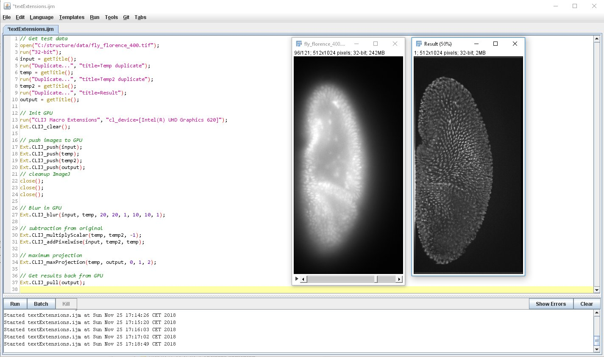
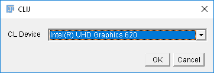
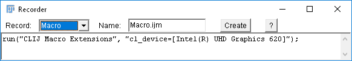
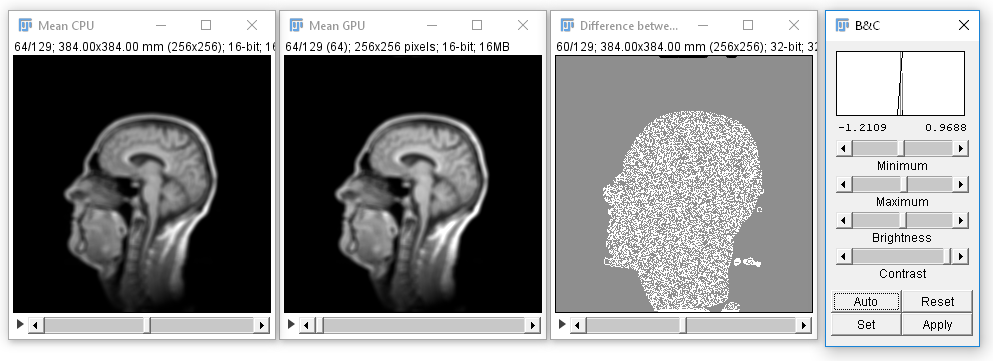

# ClearCLIJ - OpenCL based GPU image processing from ImageJ macro

Image processing in modern GPUs allows for accelerating processing speeds massively. 
This page introduces how to do image processing in the graphics processing unit (GPU) using [OpenCL](https://www.khronos.org/opencl/) from ImageJ macro inside [Fiji](http://fiji.sc) using the [ClearCLIJ](https://github.com/haesleinhuepf/clearclij/) library. 
It is not necessary to learn OpenCL itself. 
Preprogrammed routines are supposed to do GPU image processing for you with given ImageJ macro programming experience.
The list of preprogrammed routines might be extended depending on the communities needs.

This is how your code might look like if you do GPU based image processing in ImageJ macro:



## Before we start
The presented software is in early developmental stage. Yet it is unclear where this project is heading towards. 
In order to know what might be necessary to develop ClearCLIJ up to a degree where people can _just_ use it, I need your help:

* **Share efforts** I will not ask you to support coding this thing. However, you are welcome if you feel like sharing efforts.

* **Talk about your motiviation** It is very important for me to know who would use ClearCLIJ and for what. 
This is kind of necessary to justify efforts. 
Developing things like that is not my job. But I'm happy doing it; if people use it.
Please drop me a mail (rhaase@mpi-cbg.de), create a [forum post](http://image.sc) or tweet to me [@haesleinhuepf](http://twitter.com/haesleinhuepf) if you find this tool useful. 
Tell me your story. What do you do with it? How do you like it?

* **Guide development** Think about functionality you would like to have. [Formulate a github issue](https://github.com/ClearControl/clearclij/issues) or again, drop me as message.

* **Report errors** Report error messages as [github issue](https://github.com/ClearControl/clearclij/issues). 
It might be that an error only appears on your computer and I cannot see what lead to it.
Please describe in detail what you did before the error message appeared. 
Also please tell me on what computer/operating system you are running Fiji.

* **Communication is key** I do work a lot with ImageJ/Fiji and I do work a lot with OpenCL. Building the bridge between both might be a low hanging apple for me. 
But again, I need to know other people views and opinions in order to make this project successful. 

Thanks for reading. Now, let's get started.


## Installation
Download and install [Fiji from its website](https://fiji.sc/Downloads).
Add the update site `http://sites.imagej.net/clij` to your Fiji installation. [Read more about how to activate update sites]( https://imagej.net/Following_an_update_site).
Restart Fiji. ClearCLIJ is successfully installed, if you find a menu entry _Plugins > CLIJ_.

**Please note:** This is experimental software, it may have side effects on your Fiji installation and may break other plugins. 
It is strongly recommended to not install ClearCLIJ in a production environment. 
Use a freshly downloaded Fiji installation for testing experimental plugins like this. 
[Read the BSD license file](http://github.com/haesleinhuepf/ClearCLIJ/license.txt) for more details.

## A first macro
The first step is selecting the OpenCL device / GPU you would like to use to process your images. 
Start the macro recorder to record your choice by clicking Fijis menu _Plugins > Macro > Record_. 
Afterwards, click the menu _Plugins > CLIJ > CLIJ Macro Extensions_.
The selection dialog will open. Make your choice and click ok:



Ignore the error message which comes up. Have a look in the macro recorder and click it's _Create_ button.



The first macro is [help.ijm](https://github.com/haesleinhuepf/clearclij/blob/master/src/main/macro/help.ijm).
It will assist us to get an overview which methods are supported by ClearCLIJ to process images. 
It looks like this:

```java
run("CLIJ Macro Extensions", "cl_device=[Intel(R) UHD Graphics 620]");
Ext.CLIJ_help("add");
```

By executing it, you will find a list of commands containing the term `add` in their names:

```java
Found 3 method(s) containing the pattern "add":
Ext.CLIJ_addPixelwise(Image summand1, Image summand2, Image destination);
Ext.CLIJ_addScalar(Image source, Image destination, Number scalar);
Ext.CLIJ_addWeightedPixelwise(Image summand1, Image summand2, Image destination, Number factor1, Number factor2);
```

Note: The first line of this macro contains the specific name for a GPU. If you don't have the named GPU in your computer, another one will be chosen.
You don't have to enter the full name, you can also just specify a part of the name.
In order to run on any `HD` named GPU, change the program. With this, it will run on more different computers:

```java
run("CLIJ Macro Extensions", "cl_device=HD");
Ext.CLIJ_help("add");
```

Keep this example program, you might need it later again if you want to search for help on ClearCLIJ methods. 
It also tells you which parameters the methods need in order to run.

## Transferring images between ImageJ and the GPU
In order to allow images to be processed by the GPU, you need to transfer them into the memory of the GPU. 
In order to view images which were processed by the GPU, you need to transfer them back to ImageJ. 
The two methods for doing this are called `push(image)` and `pull(image)`. 
You can remove a single image from the GPUs memory by using the `release(image)` method. 
Finally, you can remove all images from the GPU with the `clear()` method.
Importantly, you cannot create images in the GPU _yet_.
In order to process an image _A_ to an image _B_, both images _A_ and _B_ need to be pushed to the GPU. 
Only then you can run methods to fill the image _B_ with values resulting from _A_. 
Finally, after processing, you pull _B_ back from the GPU to ImageJ in order to show it.

Let's have a look at an example which loads an image and blurs it using the push-pull mechanism.

```java
// Get test data
run("T1 Head (2.4M, 16-bits)");
input = getTitle();
getDimensions(width, height, channels, slices, frames);

// create an emtpy image to put the blurred pixels in
newImage("Untitled", "16-bit black", width, height, slices);
rename("Blurred");
blurred = getTitle();

// Init GPU
run("CLIJ Macro Extensions", "cl_device=[Intel(R) UHD Graphics 620]");
Ext.CLIJ_clear();

// push images to GPU
Ext.CLIJ_push(input);
Ext.CLIJ_push(blurred);

// cleanup ImageJ
run("Close All");

// Blur in GPU
Ext.CLIJ_blur3d(input, blurred, 20, 20, 1, 10, 10, 1);

// Get results back from GPU
Ext.CLIJ_pull(blurred);

// Cleanup by the end
Ext.CLIJ_clear();
```

## Sparing time with GPU based image processing
The overall goal for processing images in the GPU is sparing time. 
GPUs can process images faster because they can calculate pixel values of many pixels in parallel. 
Furthermore, images in memory of modern GPUs can be accessed faster than in ImageJ. 
However, there is a drawback: pushing/pulling the images to/from the GPU takes time. 
Thus, overall efficiency can only be achieved if whole pipelines are processed in the GPU. 
Furthermore, repeatedly using the same operations on a GPU pays off because operations are cached. Reusing them is faster than using other methods. 

Let's compare the `Mean 3D` filter of ImageJ with it's counterpart in ClearCLIJ.
The example macro is [benchmarking.ijm](https://github.com/haesleinhuepf/clearclij/blob/master/src/main/macro/benchmarking.ijm). 
It executes both operations ten times and measures the time each operation takes. 
This is just an excerpt of the macro:

```java
// Local mean filter in CPU
for (i = 1; i <= 10; i++) {
	time = getTime();
	run("Mean 3D...", "x=3 y=3 z=3");
	print("CPU mean filter no " + i + " took " + (getTime() - time));
}
```

```java
// push images to GPU
time = getTime();
Ext.CLIJ_push(input);
Ext.CLIJ_push(blurred);
print("Pushing two images to the GPU took " + (getTime() - time) + " msec");

// Local mean filter in GPU
for (i = 1; i <= 10; i++) {
	time = getTime();
	Ext.CLIJ_mean3d(input, blurred, 3, 3, 3);
	print("GPU mean filter no " + i + " took " + (getTime() - time));
}

// Get results back from GPU
time = getTime();
Ext.CLIJ_pull(blurred);
print("Pulining one image from the GPU took " + (getTime() - time) + " msec");
```

When executing the macro on an Intel Core i7-8650U CPU and Intel UHD Graphics 620 GPU, the output is:

```java
CPU mean filter no 1 took 3043 msec
CPU mean filter no 2 took 4350 msec
CPU mean filter no 3 took 4467 msec
CPU mean filter no 4 took 4611 msec
CPU mean filter no 5 took 4509 msec
CPU mean filter no 6 took 4384 msec
CPU mean filter no 7 took 4422 msec
CPU mean filter no 8 took 4379 msec
CPU mean filter no 9 took 4365 msec
CPU mean filter no 10 took 4372 msec
Pushing two images to the GPU took 819 msec
GPU mean filter no 1 took 872 msec
GPU mean filter no 2 took 183 msec
GPU mean filter no 3 took 192 msec
GPU mean filter no 4 took 195 msec
GPU mean filter no 5 took 212 msec
GPU mean filter no 6 took 251 msec
GPU mean filter no 7 took 305 msec
GPU mean filter no 8 took 300 msec
GPU mean filter no 9 took 260 msec
GPU mean filter no 10 took 263 msec
Pulling one image from the GPU took 1123 msec
```

Thus, on the CPU it takes 43 seconds, while using the GPU it just takes 5 seconds. Let's execute it again.

```java
CPU mean filter no 1 took 2596 msec
CPU mean filter no 2 took 2739 msec
CPU mean filter no 3 took 2913 msec
CPU mean filter no 4 took 3336 msec
CPU mean filter no 5 took 4643 msec
CPU mean filter no 6 took 4505 msec
CPU mean filter no 7 took 4473 msec
CPU mean filter no 8 took 4524 msec
CPU mean filter no 9 took 4414 msec
CPU mean filter no 10 took 4435 msec
Pushing two images to the GPU took 249 msec
GPU mean filter no 1 took 216 msec
GPU mean filter no 2 took 222 msec
GPU mean filter no 3 took 237 msec
GPU mean filter no 4 took 245 msec
GPU mean filter no 5 took 243 msec
GPU mean filter no 6 took 244 msec
GPU mean filter no 7 took 275 msec
GPU mean filter no 8 took 251 msec
GPU mean filter no 9 took 267 msec
GPU mean filter no 10 took 253 msec
Pulling one image from the GPU took 433 msec
```

On the CPU it still takes 39 seconds, while using the GPU it goes down to three seconds. 
The additional speedup comes from the caching mechanism mentioned above.

**Heureka, we can spare 90% of the time by executing the operation on the GPU!** 
And this works on a small laptop without dedicated GPU.
These are just rough benchmarks. 
When ClearCLIJ matures, I might do a more detailed benchmarking of several methods. 
This example here should just motivate you to test your workflow on a GPU and guide you how to evaluate its performance.

Side note: ImageJs mean filter runs _inplace_. That means the result is stored in the same memory as the input image. 
With every iteration in the for loop, the image becomes more and more blurry. 
The OpenCL operation in the GPU always starts from the _input_ image and puts its result in the _blurred_ image. 
Thus, the resulting images will look different. 
Be a sceptical scietist when processing images in the GPU. 
Check that the workflow is indeed doing the right thing. 
This is especially important when working with experimental software. 

This is the view on results from the mean filter on CPU and GPU together with the difference image of both:



In presented case, have a look at [mean.ijm](https://github.com/haesleinhuepf/clearclij/blob/master/src/main/macro/mean.ijm) to see how different the results from CPU and GPU actually are. 
In some of the filters, I observed small differences between ImageJ and OpenCL especially at the borders of the images. 
I am aware of these issues. 
There is a large number of [unit tests in the library](https://github.com/haesleinhuepf/clearclij/blob/master/src/main/java/net/haesleinhuepf/imagej/test/KernelsTest.java), 
ensuring these differences are small and in case they appear, they only influence the borders.


## Limitations
An often criticised issue when working with OpenCL is limited compatibility with graphics cards, operating systems and environments. To my best knowledge, ClearCLIJ runs on recent Intels integrated HD graphics cards and NVidia graphics cards independent of the operating system. I experienced some issues on AMD GPUs. [Check the project page for a full list of tested systems](http://github.com/haesleinhuepf/ClearCLIJ). Let me know, if you experience issues on systems which were not reported in that list.

Again, please let me know what you think about ClearCLIJ, create github issues to guide its further development and [visit the project page]() to stay up-to-date.

Happy coding!

Cheers,

Robert _@haesleinhuepf_ Haase
