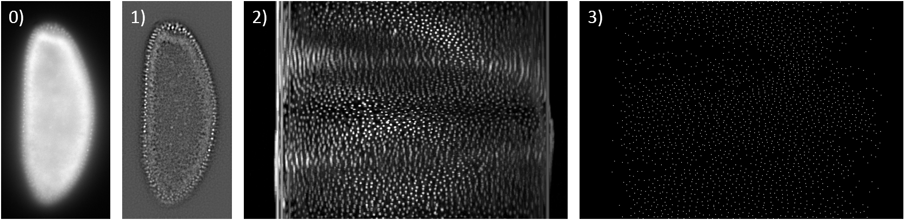
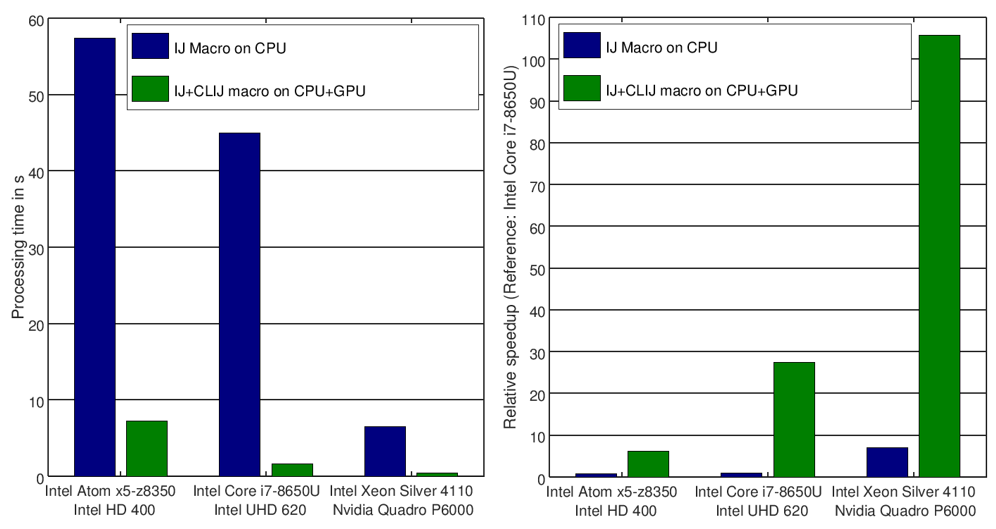

# Benchmarking CLIJ versus plain ImageJ macro
In order to demonstrate the procedures, we chose an image-processing workflow used to estimate the cell count in three 
dimensional Drosophila melanogaster embryo data sets acquired with light sheet microscopy. Such a workflow may not 
deliver exact cell counts but should allow determination of developmetal stage of the early Drosophila embryo as 
developmental stages are clearly differentiable from estimated cell counts.

## Image data
The imaged Drosophila line ([flybase 23651](http://flybase.org/reports/FBst0023651) shows histone-RFP marked nuclei when
being imaged using a 594 nm laser. 
The embryos where imaged in a custom four-illumination/dual-detection light sheet microscope subsequently. 
The image data is [available online](https://bds.mpi-cbg.de/putlinkhere).
The image stacks stored with 16 bits per voxel are 121 MByte large on disc, with 512x1024x121 voxels and a voxel size of
0.52x0.52x2.0 cubic micrometer. 
Image stacks of the first 39 time points were analysed. As it were three embryos imaged subsequently, this corresponds to
117 image data sets corresponding to 14 GB of image data.

## Image analysis workflow
The presented workflow consists of three major steps: 1) background subtraction, 2) surface projection and 3) spot counting. 
The image stacks are used to generate a Difference-of-Gaussian image, rescale it prior to a cylindrical reslicing 
transformation projecting nuclei on the Drosophilas surface onto a two-dimensional image. In this image spot-detection
is applied to estimate the number of nuclei. Intermediate results of an example image being processed are shown here:

The source code of both workflows is [available online](https://mpicbg-csbd.github.io/clij-docs/blob/master/src/main/macro/benchmarking).

Benchmarking was executed on 
* a mid-range priced laptop computer with a recent Intel Core i7-8650U CPU and a Intel UHD 620 GPU, 
* a mid-ranged priced laptop computer with an AMD Ryzen 3 CPU and an AMD Vega 6 GPU,
* a low priced laptop with a an Intel Atom x5-Z8350 combined with an Intel HD 420 GPU and 
* a workstation with an Intel Xeon Silver 4110 in combination with a Nvidia P6000 GPU. 

## Preliminary results
On a laptop equipped with an Intel i7-8650U, the pure ImageJ implementation took ?? seconds per time point and thus, 
approximately ?? minutes for processing the whole time lapse. 
The fastest execution was achieved using the CLIJ-based workflow on an NVidia P6000. There the whole timelapse was 
procesed in ?? minutes.

On the same laptop the CLIJ-based workflows utilizing an Intel UHD 620 GPU took ?? seconds per time point. 
The whole timelapse was processed in ?? minutes (including reading/writing images from/to disc), 
? minutes and 4.0 minutes (d) respectively. 

On the other end of the price range of tested GPUs, an Intel HD 400 built-in Intel Atom x5-z8350 processed a time point 
in ? seconds.

[Back to CLIJ documentation](https://clij.github.io/clij-docs/)

