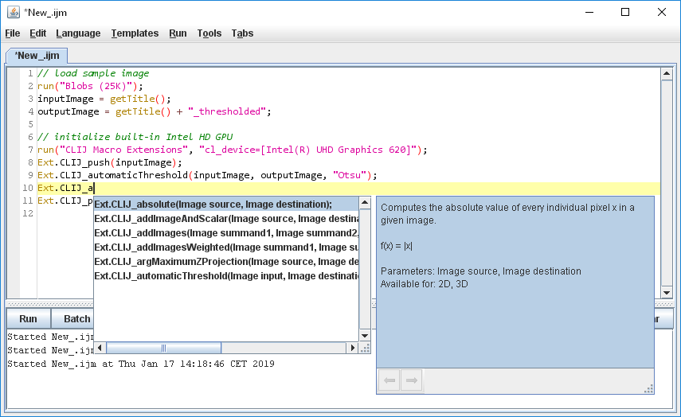
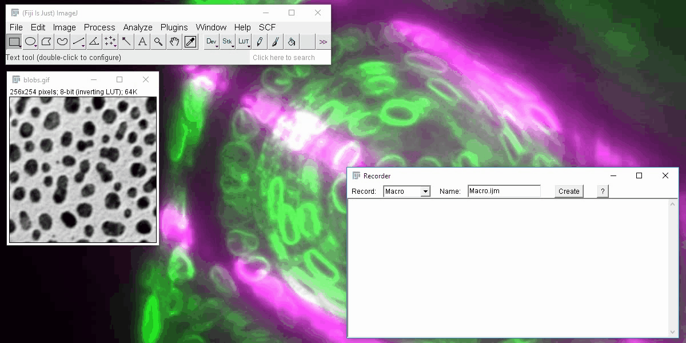
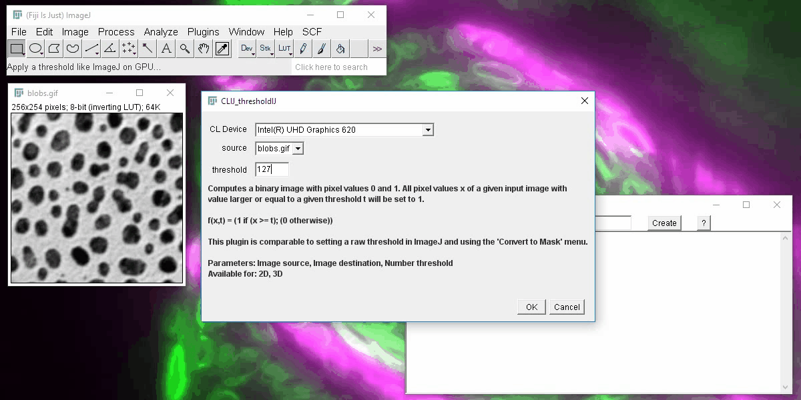

# CLIJ - a quick tour
CLIJ is a [Fiji](https://fiji.sc) plugin for GPU-accelerated image processing based on [OpenCL](https://opencl.prg). However, it is not necessary to learn OpenCL. CLIJ has about 100 predefined functions allowing you to process your images on the GPU.

It is recommended to use it from Fiji script editor using the ImageJ macro language. For the ease of use, auto-completion is enabled for editing CLIJ workflows.

Furthermore, CLIJ has its own menu: `Plugins > ImageJ on GPU (CLIJ)` with sub menus offering all CLIJ functionality.

When clicking on the menu, you see a dialog asking for the parameters of the specific CLIJ operation. Furthermore, user documentation and parameter exlanation is given in the same dialog.

CLIJ is fully macro-recordable. After recording your workflow, it can be executed right away. 

For exploring CLIJ further, it is recommended to read the [introduction for macro programmers](macro_intro) and have a look at the [code examples](https://clij.github.io/clij-docs/src/main/macro);

[Back to CLIJ documentation](https://clij.github.io/)

[Imprint](https://clij.github.io/imprint)

